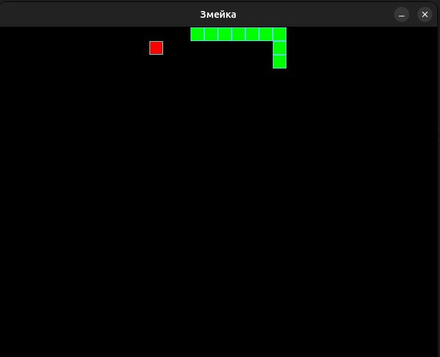

# The Snake

## Описание проекта

"The Snake" — это классическая игра "Змейка", реализованная с использованием языка Python и библиотеки Pygame. Проект демонстрирует применение принципов объектно-ориентированного программирования (ООП) для создания интерактивных игр.

## Функциональные возможности

- Управление змейкой с помощью клавиш-стрелок
- Сбор яблок для увеличения длины змейки
- "Зацикленное" игровое поле (змейка может проходить через границы)
- Обнаружение столкновений змейки с самой собой
- Автоматическое сбрасывание игры при столкновении

## Установка и запуск

1. Убедитесь, что на вашем компьютере установлен Python 3.x
2. Установите библиотеку Pygame с помощью команды:
   ```
   pip3 install pygame
   ```
3. Скачайте файл `the_snake.py`
4. Запустите игру с помощью команды:
   ```
   python3 the_snake.py
   ```

## Структура кода

Проект использует следующие ООП-концепции:

### Классы и наследование

1. **GameObject** — базовый класс для всех игровых объектов
   - Определяет общие свойства: позицию и цвет
   - Содержит абстрактный метод `draw()` для отрисовки

2. **Apple** — класс яблока, наследуется от GameObject
   - Расширяет базовый класс, добавляя случайное позиционирование
   - Переопределяет метод `draw()` для отрисовки яблока

3. **Snake** — класс змейки, наследуется от GameObject
   - Хранит список позиций всех сегментов тела змейки
   - Реализует логику движения и обработки столкновений
   - Переопределяет метод `draw()` для отрисовки всего тела змейки

### Инкапсуляция

- Каждый класс скрывает внутреннюю реализацию и предоставляет четкие методы для взаимодействия
- Логика обработки столкновений и перемещения реализована внутри класса Snake

### Полиморфизм

- Метод `draw()` реализован по-разному в каждом классе, но используется единообразно

## Управление

- **↑** — движение вверх
- **↓** — движение вниз
- **←** — движение влево 
- **→** — движение вправо

## Технические детали

- Игровое поле имеет размеры 640×480 пикселей
- Яблоко отображается красным квадратом
- Змейка отображается зелеными квадратами
- Скорость игры: 20 кадров в секунду

## Архитектура игры

Игра использует стандартный игровой цикл:
1. Обработка пользовательского ввода
2. Обновление состояния игры
3. Отрисовка игровых объектов
4. Повтор цикла

## Скриншот игры



_□□□□ — змейка, ■ — яблоко_
